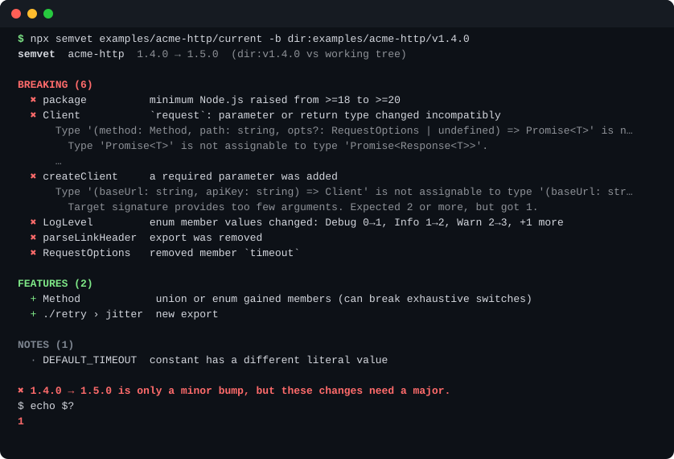
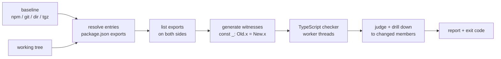

<div align="center">

# semvet

**Does this release need a major bump?**
Compares your TypeScript package's public API with the last release, using the compiler's own assignability rules.

[](https://github.com/Nithinfgs/semvet/actions/workflows/ci.yml)
[](LICENSE)




</div>

## In 20 seconds

You changed some types and typed `1.5.0` into `package.json`. semvet builds small programs of the form
`const _: Old.fn = New.fn`, lets TypeScript decide whether the new API still fits where the old one was used,
and tells you which export broke, why, and whether your version bump is big enough.

- Runs on the **declaration files you already ship**. No config needed for the common case.
- **Explains** each break with the compiler's own message, down to the member that changed.
- **CI ready:** exit codes, JSON, Markdown for the job summary, GitHub annotations, a composite Action.
- **Offline** unless you ask for an npm baseline. No telemetry, no API keys, never runs the code it compares.

## Why this exists

Rust has `cargo-semver-checks`. In TypeScript, most maintainers pick a version number by feel, and the breaks
that hurt are the quiet ones: a parameter that became required, an optional option that was dropped, a return
type wrapped in a new shape, an enum that shifted its numbers. semvet is an attempt at the same safety net,
built on the one component that already knows the language's rules: the type checker.

## Quick start

```bash
# In your package, after building so "types" points at real .d.ts files:
npx github:Nithinfgs/semvet            # compares with the latest version on npm
npx github:Nithinfgs/semvet -b git:v1.4.0 -e src/index.ts   # compare with a git tag, from source
npx github:Nithinfgs/semvet -b dir:../old-checkout          # compare with any directory
```

> npm release is planned; until then run it straight from GitHub (npm builds it on first use) or clone and
> `npm ci && npm run build`.

Try the bundled example, a "minor" release with hidden breakage:

```bash
git clone https://github.com/Nithinfgs/semvet && cd semvet && npm ci
npm run demo     # prints the report above and exits 1
```

## Example

[`examples/acme-http`](examples/acme-http) holds `v1.4.0` and a working tree labelled `1.5.0`. The 1.5.0 changes
look harmless in review:

```diff
- export declare function createClient(baseUrl: string): Client;
+ export declare function createClient(baseUrl: string, apiKey: string): Client;

  export interface RequestOptions {
    headers?: Record<string, string>;
-   timeout?: number;
    retries?: number;
+   signal?: AbortSignal;
  }

  export declare class Client {
-   request<T>(method: Method, path: string, opts?: RequestOptions): Promise<Response<T>>;
+   request<T>(method: Method, path: string, opts?: RequestOptions): Promise<T>;
  }

  export declare enum LogLevel {
+   Trace = 0,
-   Debug = 0,
+   Debug = 1,
```

semvet reports all of them, and that `1.4.0 → 1.5.0` is too small. `PATCH` added to a union is a feature, a changed
`const` literal is only a note.

## What it checks

| Area | Examples it catches |
|------|---------------------|
| Functions & methods | new required parameter, narrowed parameter, widened return type, generic return reshaped |
| Object types & classes | removed or retyped members, removed optional members, new required constructor argument |
| Unions & enums | removed members (breaking), added members (feature), shifted enum values |
| Modules | removed exports, removed subpath exports, namespace members, `export *`, renames |
| Package | removed `bin`, `"type"` flip, higher `engines.node` |
| Noise control | `@internal`/`@alpha` tags, ignore globs, per-rule severity |

Details and the full rule list: [docs/how-it-works.md](docs/how-it-works.md).

## How it works



The checker runs in worker threads in batches. If a batch runs out of time or memory (deeply recursive generic
APIs do this), semvet splits it until the offending exports are isolated, skips only those with a warning, and
still reports everything else.

## Use in CI

```yaml
# .github/workflows/semver.yml
on: pull_request
jobs:
  semvet:
    runs-on: ubuntu-latest
    steps:
      - uses: actions/checkout@v4
      - uses: actions/setup-node@v4
        with: { node-version: 22 }
      - run: npm ci && npm run build
      - uses: Nithinfgs/semvet@main
        with:
          baseline: npm:your-package@latest   # or git:<tag>, dir:<path>
          fail-on: insufficient-bump
```

The Action writes a Markdown report to the job summary and emits annotations. It builds semvet from its own
source on each run (about 20 seconds) until an npm release exists.

Exit codes: `0` fine, `1` the version bump is too small (or any breaking change with `--fail-on breaking`),
`2` error. If the version in `package.json` equals the baseline's, semvet prints what the *next* release needs
and exits 0.

## Configuration

`semvet.config.json` (or a `"semvet"` key in `package.json`):

```json
{
  "baseline": "git:v1.4.0",
  "entries": ["src/index.ts"],
  "ignore": ["internal*", "Http.legacy*"],
  "ignoreTags": ["internal", "alpha"],
  "rules": { "engines-raised": "note", "constant-changed": "off" }
}
```

| Flag | Meaning |
|------|---------|
| `-b, --baseline <spec>` | `npm:<name>@<ver>`, `git:<ref>`, `dir:<path>`, `<file>.tgz` (default `npm:<name>@latest`) |
| `-e, --entry <file>` | Compare this file instead of `package.json` `exports` (repeatable) |
| `-n, --next <version>` | Version you plan to release |
| `-f, --format` | `text`, `json`, `markdown`, `github` |
| `--fail-on` | `insufficient-bump` (default), `breaking`, `never` |
| `--timeout`, `--memory` | Budget for the type-checking phase |
| `-v, --verbose` | Full compiler explanations |

## Known limits

semvet answers a *type-level* question, and TypeScript has blind spots of its own. Documented in
[docs/how-it-works.md](docs/how-it-works.md#known-limits); the short version:

- Behavioural changes with identical types are invisible.
- `readonly` changes, `declare module` augmentations and wildcard `exports` patterns are not compared.
- Overloaded and generic *methods* keep TypeScript's bivariant parameter check.
- Extremely type-heavy libraries may have individual exports skipped (with a warning) when they exceed the budget.

I sanity-checked it against real major releases (`commander` 11→12 and `chalk` 4→5 flag the changes those
releases are known for), but it is young software. If it gets a verdict wrong, a two-snippet bug report is the
most useful contribution there is.

## Roadmap

- [ ] npm release
- [ ] `--baseline npm:` with a local cache
- [ ] `readonly` and `declare module` checks
- [ ] Wildcard `exports` expansion
- [ ] Strict checking for overloaded and generic methods
- [ ] SARIF output

## Contributing

Start with [CONTRIBUTING.md](CONTRIBUTING.md). The development loop is `npm ci && npm test`. Each rule is a small,
test-driven change.

## License

[MIT](LICENSE)
