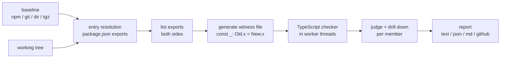

# semvet: product specification

**Name:** semvet (semver + vet, as in `go vet`). Checked: not taken on npm; no GitHub repository with that name
except an unrelated 2017 homework repo.

**Pitch:** Does this release need a major bump? semvet compares your TypeScript package's public API with the last
release, using the compiler's own assignability rules.

## Problem

Maintainers choose version numbers by feel. Type-level breaking changes (a parameter that became required, a
property that vanished, a return type that widened) are easy to miss in review and hurt every downstream user.

## Users

Maintainers of TypeScript libraries and internal packages, and CI pipelines that gate releases.

## Core workflow

```
semvet            # compare working tree with the last published version
semvet -b git:v1.4.0 -e src/index.ts
semvet -b dir:../old-build
```

Output: breaking changes, features, notes, and a verdict about the declared bump.

## Killer feature

Compiler-driven witnesses plus a drill-down: instead of "types differ", semvet says which member or parameter
changed and shows TypeScript's own explanation.

## Features

1. Public API diff via assignability witnesses (functions, classes, interfaces, aliases, enums, namespaces).
2. Generic-aware: signatures are re-checked with opaque probe types so `Promise<T>` vs `Promise<{data: T}>` is caught.
3. Package-level rules: removed subpath exports, removed bin commands, module type, minimum Node.
4. Baselines: npm version, git ref, directory, tarball.
5. CI output: exit codes, JSON, Markdown for step summaries, GitHub annotations, ready-made Action.
6. Config: ignore globs, `@internal`/`@alpha` tags honoured, per-rule severity.

## Non-goals

- Behavioural breaking changes (same types, different runtime behaviour).
- JavaScript-only packages without types.
- Replacing changelogs or release tooling (use it as a gate for them).
- Auto-fixing or bumping versions.

## Architecture



## Stack

TypeScript (strict), Node >= 18.18, one runtime dependency (`typescript`), Biome for lint/format,
`node:test` for tests, GitHub Actions for CI.

## Repository structure

```
src/        engine, CLI, reports
test/       node:test suites (API cases, package rules, CLI, semver)
examples/   acme-http: a v1.4.0 baseline and a "1.5.0" working tree with hidden breakage
docs/       research, assets
scripts/    test runner, demo asset generation
action.yml  composite GitHub Action
```

## Installation

`npx semvet` (no install), or `npm i -D semvet`.

## Expected demo

`npx semvet examples/acme-http/current -b dir:examples/acme-http/v1.4.0` prints six breaking changes hiding in a
"minor" release and exits 1.
